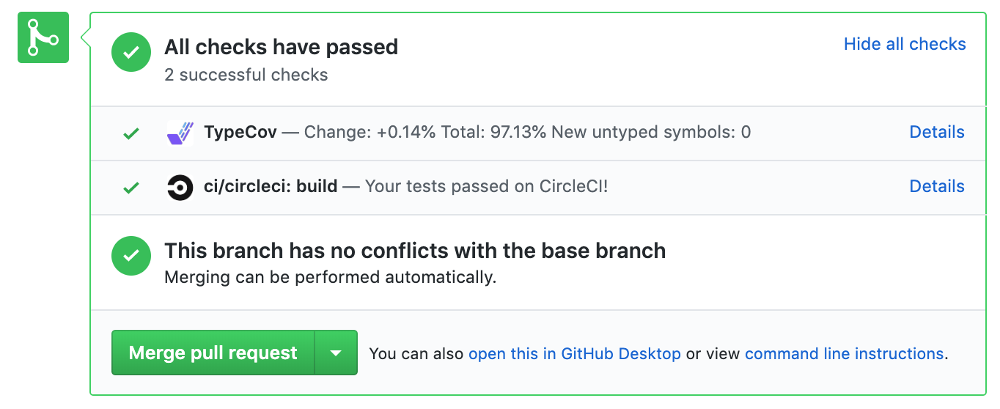

<p align="center">
  
  <h3 align="center">Type Coverage Watcher</h3>
  <p align="center">Track missing type coverage in TypeScript projects to ensure type safety</p>

  <p align="center">
    <a href="https://circleci.com/gh/codechecks/type-coverage-watcher"></a>
    <a href="/package.json"></a>
    <a href="https://codechecks.io"></a>
  </p>
</p>

## Install

```sh
npm add --save-dev @codechecks/type-coverage-watcher
```

## Usage

Are you new to codechecks? Check out [getting started guide (it's simple)](https://github.com/codechecks/docs/blob/master/getting-started.md)!

Add to your `codechecks.yml` file:

```yml
checks:
  - name: type-coverage-watcher
  # ...
```

Under the hood it uses [type-coverage](https://github.com/plantain-00/type-coverage) package.

## API

### typeCoverageWatcher(options: Options): Promise\<void>

#### options

```typescript
interface Options {
  tsconfigPath?: string; //defaults to tsconfig.json
  name?: string; // defaults to Type Coverage
  ignoreFiles?: string[];
  ignoreCatch?: boolean;
  atLeast?: number;
  strict?: boolean;
}
```

##### tsconfigPath

optional `string`<br>\
Default: `tsconfig.json`<br>\
Path to typescript project configuration

##### name

optional `string`<br>\
Defaults: `Type Coverage`<br>\
Specify the name for check. Might be useful in monorepos.

##### ignoreFiles

optional `string[]`<br>\
Defaults: `undefined`<br>\
Specify the ignored for checks files.

##### ignoreCatch

optional `string`<br>\
Defaults: `undefined`<br>\
See [type-coverage's description](https://github.com/plantain-00/type-coverage#ignore-catch) for the reference.

##### atLeast

optional `number`<br>\
Defaults: `undefined`<br>\
Example: `atLeast: 99`<br>\
Fail if coverage rate < this value.

##### strict

optional `string`<br>\
Defaults: `undefined`<br>\
See [type-coverage's description](https://github.com/plantain-00/type-coverage#strict-mode) for the reference.

## Contributing

All contributions are welcomed. Read more in [CONTRIBUTING.md](./CONTRIBUTING.md)

## Licence

MIT @ [codechecks.io](https://codechecks.io)
